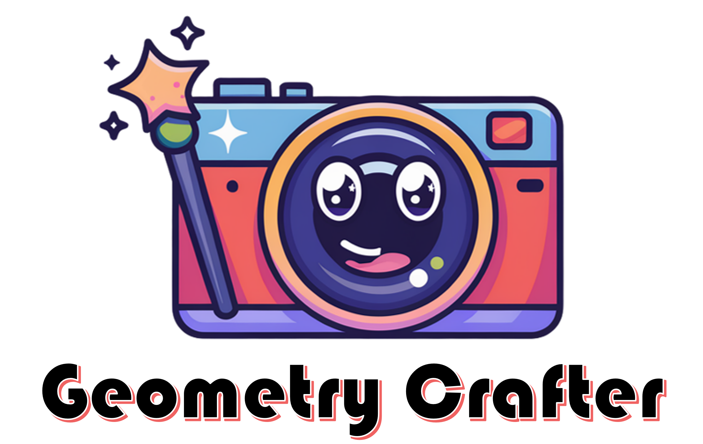

## ___***GeometryCrafter: Generating Consistent Long Depth Sequences for Open-world Videos***___
<div align="center">
</img>
<br>

_**[Tian-Xing Xu<sup>1</sup>](https://scholar.google.com/citations?user=zHp0rMIAAAAJ&hl=zh-CN), 
[Xiangjun Gao<sup>3</sup>](https://scholar.google.com/citations?user=qgdesEcAAAAJ&hl=en), 
[Wenbo Hu<sup>2 &dagger;</sup>](https://wbhu.github.io), 
[Xiaoyu Li<sup>2</sup>](https://xiaoyu258.github.io), 
[Song-Hai Zhang<sup>1 &dagger;</sup>](https://scholar.google.com/citations?user=AWtV-EQAAAAJ&hl=en), 
[Ying Shan<sup>2</sup>](https://scholar.google.com/citations?user=4oXBp9UAAAAJ&hl=en)**_
<br>
<sup>1</sup>Tsinghua University
<sup>2</sup>ARC Lab, Tencent PCG
<sup>3</sup>HKUST

 &nbsp;
 <a href='https://arxiv.org'></a> &nbsp;
 <a href='https://geometrycrafter.github.io'></a> &nbsp;
 <a href='https://huggingface.co/spaces/tencent/GeometryCrafter'></a> &nbsp;

</div>

## 🔆 Notice

**GeometryCrafter is still under active development!**

We recommend that everyone use English to communicate on issues, as this helps developers from around the world discuss, share experiences, and answer questions together. For further implementation details, please contact `xutx21@mails.tsinghua.edu.cn`. For business licensing and other related inquiries, don't hesitate to contact `wbhu@tencent.com`.

If you find GeometryCrafter useful, **please help ⭐ this repo**, which is important to Open-Source projects. Thanks!

## 📝 Introduction

We present GeometryCrafter, a novel approach that estimates temporally consistent, high-quality point maps from open-world videos, facilitating downstream applications such as 3D/4D reconstruction and depth-based video editing or generation.

Release Notes:
- `[07/04/2025]` 🔥🔥🔥**GeometryCrafter** is released now, have fun!

## 🚀 Quick Start

### Installation
1. Clone this repo:
```bash
git clone --recursive https://github.com/Tencent/GeometryCrafter
```
2. Install dependencies (please refer to [requirements.txt](requirements.txt)):
```bash
pip install -r requirements.txt
```

### Inference

Run inference code on our provided demo videos, requires a GPU with ~40GB memory for 110 frames with 1024x576 resolution:

```bash
python run.py \
  --video_path examples/video1.mp4 \
  --save_folder workspace/examples_output \
  --height 576 --width 1024
  # resize video to the target resolution for processing, which should be divided by 64 
```

Run inference code with our deterministic variant

```bash
python run.py \
  --video_path examples/video1.mp4 \
  --save_folder workspace/examples_output \
  --height 576 --width 1024 \
  --model_type determ
```

Run low-resolution inference requires a GPU with ~22GB memory for 640x384 resolution:

```bash
python run.py \
  --video_path examples/video1.mp4 \
  --save_folder workspace/examples_output \
  --height 384 --width 640
```

### Visualization

Visualize the predicted point maps with `Viser`

```bash
python visualize/vis_point_maps.py \
  --video_path examples/video1.mp4 \
  --data_path workspace/examples_output/video1.npz
```

## 🤖 Gradio Demo

- Online demo: [**GeometryCrafter**](https://huggingface.co/spaces/tencent/GeometryCrafter)
- Local demo:
  ```bash
  gradio app.py
  ```

## 📊 Dataset Evaluation

Please check the `evaluation` folder. 
- To create the dataset we use in the paper, you need to run `evaluation/preprocess/gen_{dataset_name}.py`.
- You need to change `DATA_DIR` and `OUTPUT_DIR` first accordint to your working environment.
- Then you will get the preprocessed datasets containing extracted RGB video and point map npz files. We also provide the catelog of these files.
- Inference for all datasets scripts:
  ```bash
  bash evaluation/run_batch.sh
  ```
  (Remember to replace the `data_root_dir` and `save_root_dir` with your path.)
- Evaluation for all datasets scripts (scale-invariant point map estimation):
  ```bash
  bash evaluation/eval.sh
  ```
   (Remember to replace the `pred_data_root_dir` and `gt_data_root_dir` with your path.)
- Evaluation for all datasets scripts (affine-invariant depth estimation):
  ```bash
  bash evaluation/eval_depth.sh
  ```
   (Remember to replace the `pred_data_root_dir` and `gt_data_root_dir` with your path.)
- We also provide the comparison results of MoGe and the deterministic variant of our method. You can evaluate these methods under the same protocol by uncomment the corresponding lines in `evaluation/run.sh` `evaluation/eval.sh` `evaluation/run_batch.sh` and `evaluation/eval_depth.sh`.

## 🤝 Contributing

- Welcome to open issues and pull requests.
- Welcome to optimize the inference speed and memory usage, e.g., through model quantization, distillation, or other acceleration techniques.

## 📜 Citation

If you find this work helpful, please consider citing:

```BibTeXw
  TODO
```